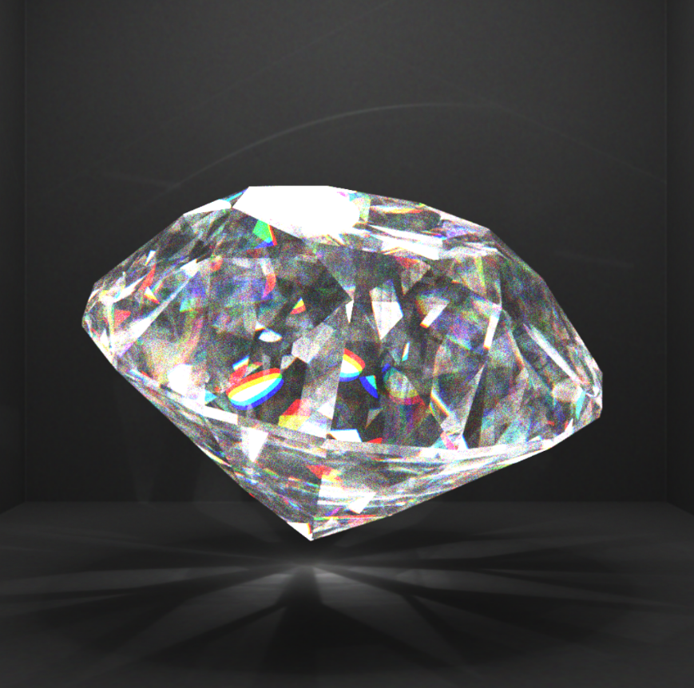
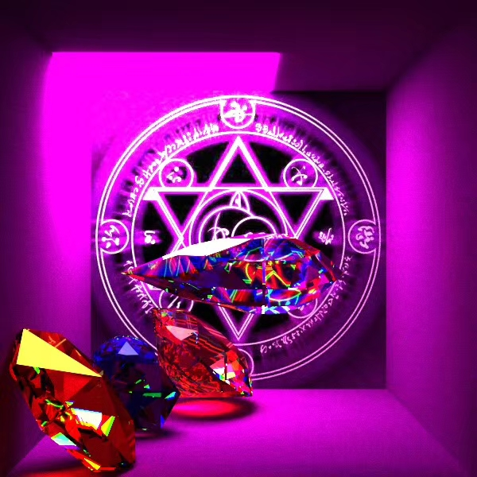
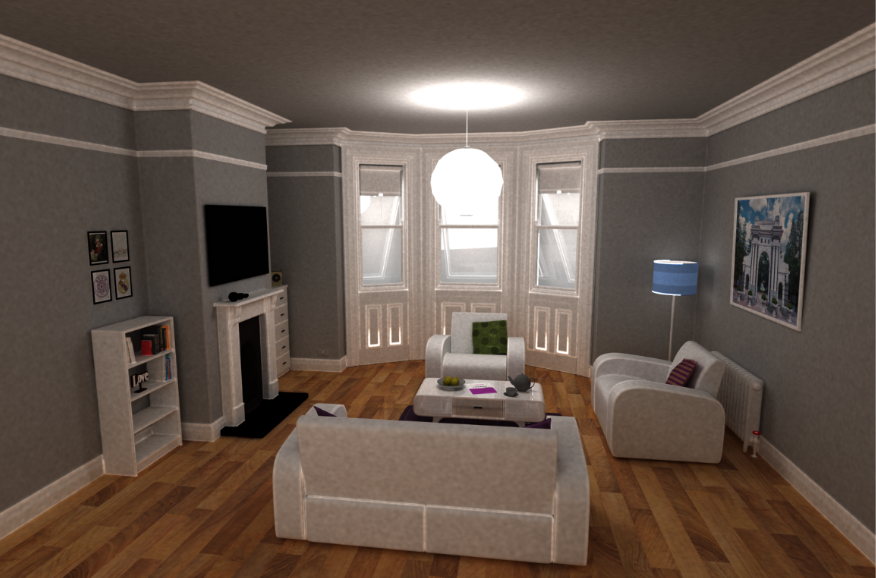
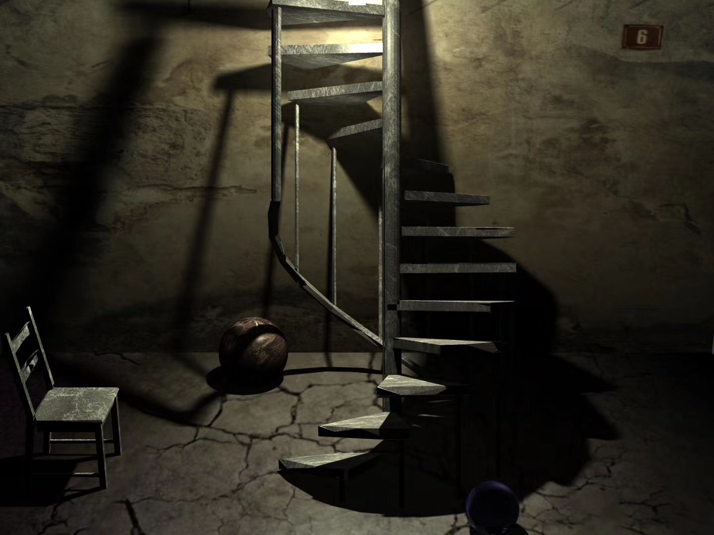

# Computer-Graphics-2020

先放一些效果图，再来吐槽一下

这是我两年来用时最长和码量最大的项目了，虽然大部分时间都在调场景和等渲染。

除却个别的大佬，从零入手最好的资料就是祖传代码和文档了，网上自然能找到不少：

计3 古裔正学长的https://blog.csdn.net/zsyzgu/article/details/46592041 ，这份代码极其OO，但基础算法选了普通的RT，导致效果看起来不太行，不过我的SPPM基本是借鉴他的。

计6 n+e的https://github.com/Trinkle23897/Computational-Graphics-THU-2018 ，据说他的SPPM是假的，但至此之后所有人都知道了smallpt，所有人都学会了Bezier旋转面求交。

计7 MashPlant的https://github.com/MashPlant/computational_graphics_2019 ，写了体积光外的所有功能。

可以很明显看出一代更比一代强，毕竟前人打下的基础足够牢靠，只需要花一些时间通读一下，老老实实当一个缝合怪，做一个高仿并不是很难的事。这也导致通胀严重，内卷加剧，助教的评分标准几乎失效。当然，拿高分容易了许多。

曾经在我写体积光和构图时，除了追求fancy的效果外，也是幻想过拿A+的，毕竟相对助教的满分标准超出了15分以上。但在图形学严格的控分机制下，这样的工作量注定无法在内卷中胜出，以后会越来越不可能。与其费心构图、费时提升画质被卷成A，不如拿满基础功能后象征性体现一下效果躺平A。

不过在参考他人的一些成果后，我也发现了令我遗憾之处。许多被知难而退的分数并没有想象中的难，比如我曾因KD树难以改为迭代而没有写CUDA，实际上何必非要搞一个完善的项目，只改最elementary的smallpt也能拿到分数。我曾以为色散会几十倍地增加渲染时间而主动放弃，事后发现离散色散是最好写的附加项之一，虽模拟得并不真实但炫酷就完事。比如下面两张

我也没有利用图形学的公开资料，MIT等学校的图形学公开课是提供了obj解析代码和转换工具的，还有众多著名的网格模型。直接使用网格作为布景进行渲染会得到真实感很强的场景，我粗调精调得到的构图被上百万甚至上亿面片的大型网格随手一扔的效果完爆，比如下面几张

值得一提的是，最后一张是某神仙用了5G的网格模型渲染出来的，这让我这样把图形学作为一门2学分课程对待的普通同学直呼内行，活脱脱一个离线渲染引擎。

总之，在当前的评分标准下，图形学课上的平均水平将一届届向满分逼近。不妨一项项分析一下：

光线追踪：smallpt一把梭，既好写又效果好

SPPM：可以参考的祖传代码已经够多了吧

景深 +软阴影 +抗锯齿 + 贴图 / 凹凸贴图：这些都是简单几行代码的效果

参数曲面解析法求交：直接抄n+e的，简单易懂

GPU并行加速：基于smallpt写CUDA，网格和镜面漫反射这样难改迭代的直接砍掉，最好渲染几个视频出来，或许已经有祖传代码了（见https://github.com/Guangxuan-Xiao/Computer-Graphics-2020 ）

光线求交加速：三角网格和KD树也可以抄祖传代码，私以为我的KD树就写的不错（x

设计和构图：光是这个文档里的效果图就已经能提供足够灵感了吧

体积光：我的写法是挺简单的，魔改PM，光子图和KD树写法与SPPM无异

色散：红绿蓝三个分量以不同折射率跑三张图出来，合并一下（代码工作量≈0，渲染时间x3）。连续谱色散可以参考MashPlant

这样一看，我如果是下一届学生，一天之内就可以缝合一个全功能的大作业出来（除了我不太了解的体渲染），毕竟助教只认得分项，只认效果，不认工作量，不认代码来源。这就是以后的baseline咯？

update: 前几天又考察了一番，发现那个5GB的渲染图是与Stanford兔、天使Lucy一样著名的公开模型，被一些著名的C++离线渲染引擎拿来做效果图。要问我有什么现成的完善的离线渲染引擎？PBRT3和Mitsuba了解一下，上万行C++代码，功能极其完善（路径追踪，光子映射，甚至较新颖的PSMLT、VCM），各种BSDF材质，支持BSSDF、体渲染，什么烟雾毛发塑料不在话下。Mitsuda还天然支持各种形式的硬件加速。有时间的话，提前两个月甚至寒假开始，复现（抄）个PBRT3或者Mitsuba的大部分功能出来。
